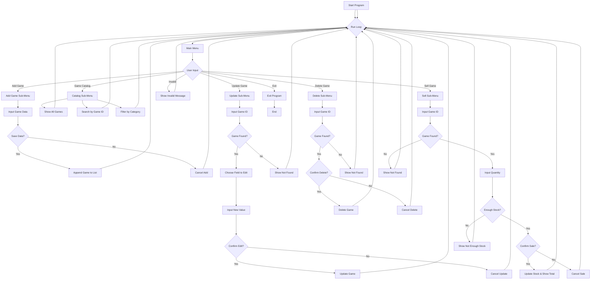

# Game Store Inventory & Sales System 

## 📌 Project Overview

This is a is a command-line-based application designed to help game store businesses manage their product data efficiently. The system provides essential features to add, view, update, delete, and sell games. This tool allows store owners or staff to monitor inventory and track sales without the need for complex software.

## Features

The system supports the following key functionalities, grouped by CRUD operations and transaction handling:

### Create (Add Game Data)
- Add new game records with required fields: ID, name, category, genre, stock, and price.
- Validate inputs for format and value (e.g., ID format, no negative stock/price).
- Prevent duplication of Game ID.
- Option to confirm before saving the new game to the database.

### Read (View Game Catalog)
- View all available games in a formatted table.
- Search game data by:
  - Game ID
  - Category (e.g., Nintendo, Playstation, Xbox)

### Update (Modify Game Data)
- Update any field (except Game ID) for a specific game.
- Input validation is enforced depending on the field type (numeric or alphabetic).
- Confirmation required before applying changes.

### Delete (Remove Game Data)
- Remove a game entry by ID.
- Preview game details before deletion.
- Confirmation prompt to avoid accidental removal.

### Sell (Process Game Transactions)
- Reduce stock based on sale quantity.
- Prevent over-selling by checking stock availability.
- Display total transaction amount and remaining stock.

## Business Understanding

Retail game stores often struggle with managing their inventory and tracking transactions efficiently, especially when relying on manual recordkeeping. This system simulates a lightweight digital solution for those stores, helping staff manage daily operations and improve accuracy in stock control and sales recording.

## Target Users

This application is intended for:
- Small to medium-sized game store owners and staff.
- Students or beginners learning Python who want to practice CRUD logic.
- Anyone building a simple inventory or sales tracking system in a terminal-based environment.

## Data Structure

The application uses a list of dictionaries to store game data. Each game entry follows this format:

```python
{
    "Id": "GN001",
    "Name": "Pokemon Legends Arceus",
    "Category": "Nintendo",
    "Genre": "Action RPG",
    "Stock": "25",
    "Price": "650000"
}

Accepted Categories:
- Nintendo
- Playstation
- Xbox
```
## Functional Breakdown
The system is modularized into several functions, each responsible for specific operations:

- `mainDashboard()`: Displays the main menu.
- `inputMenu()`: Receives user input.
- `addGame()`: Handles input, validation, and storage of new game data.
- `listGame()`: Shows all games.
- `gameById()`: Displays a game by its ID.
- `gameByCategory()`: Filters games by category.
- `updateGame()`: Edits a selected field of a game.
- `deleteGame()`: Deletes a game after confirmation.
- `sellGame()`: Handles sales transaction and reduces stock.
- `startMenu()`: Runs the main program loop.

## How to Use
  1. Save the Code: Save the Python source file as `Capstone Project_Patrick Jonathan.py`

  2. Open Terminal or Command Prompt: Navigate to the folder where the file is saved.

  3. Run the Program: Execute the program using the command:

## Menu Navigation
When the program runs, the user will be presented with this main menu:

  ==== GAME STORE MENU ====
  1. Add Game
  2. Game Catalog
  3. Update Game
  4. Delete Game
  5. Sell Game
  6. Exit

Each option leads to relevant submenus for more specific tasks.

## Flowchart
The following flowchart summarizes the flow of the program:



## Author
Patrick Jonathan / patrickjoo
